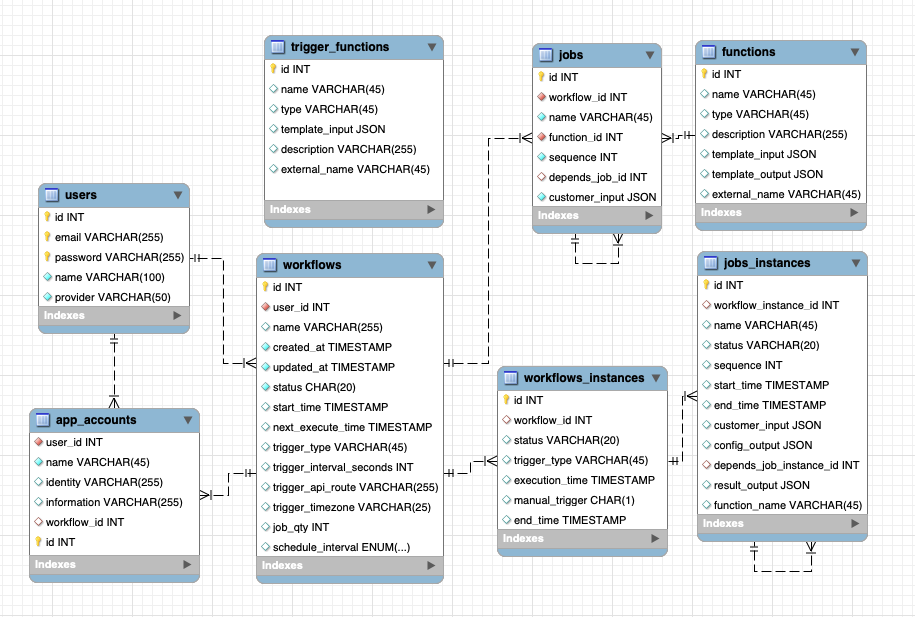

# Functionflow

## Description
Functionflow is an integration platform that empowers users to freely combine various jobs as a workflow, while offering the flexibility to select the execution time through scheduled trigger service, automate and customize with ease.

This projects contains:

- [The sever and fronted page ](https://github.com/tzutingspace/functionflow)
- [The code for all pre-built integration components](https://github.com/tzutingspace/functionflow_lambda)

## Demo
- URL:  
  https://tingproject.link
- Test Account  
  email: `testuser@gmail.com`  
  password: `123456`

## Features and Technologies
- Build workflow
- Manual Trigger

demo create workflow and manual trigger

<!-- https://youtu.be/Xbw6ejCxQPM -->

## Database Schema 

## Architecture 

## Contact 
Email: tzutingh2@gmail.com
