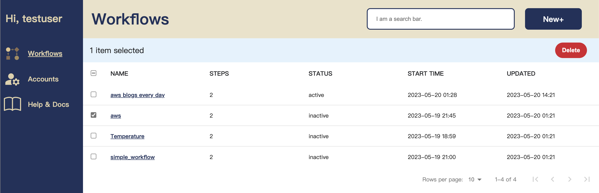

# Functionflow

## Description
***
Functionflow is an integration platform that empowers users to freely combine various jobs as a workflow, while offering the flexibility to select the execution time through scheduled trigger service, automate and customize with ease.

This projects contains:

- [Backend server and frontend web pages ](https://github.com/tzutingspace/functionflow)
- [The code for all pre-built integration job-components](https://github.com/tzutingspace/functionflow_lambda)
 
## Demo
***
- Website URL: https://tingproject.link
- Test Account:
  - Email: `testuser@gmail.com`  
  - Password: `123456`

## Features
***
### Create a workflow  
- Offering daily, weekly, monthly, or customized schedule trigger options.
- Provided keyword crawling feature for PTT, AWS blog and weather information by an open API
- Integrated a notification system with Discord and enabled email service using MailerSend

Click the image below to watch a brief demo on YouTube.  
  

### Manual trigger a workflow 
- Incorporated a manual trigger feature for workflows, leveraging AWS Lambda for execution, and combined a real-time notification system through Socket.IO 

Click the image below to watch a brief demo on YouTube.

### Management page for all workflows
- Displaying the current status of all workflows and allowing the deletion of specific workflows.  

### Workflow History or Edit Workflow 
- For a specific workflow, you can check the history records, edit the workflow, and switch it between inactive and active states..

## Database Schema 
***

## Architecture 
***

## Technologies
***
### Back-end
- Environment: Linux + Node.js
- Framework: Express
- Real-time Data Transport: Socket.io

### Front-End
- Library: React

### Database
- MySQL

### Workflow Jobs 
- AWS Lambda
- Amazon Simple Queue Service (SQS) 

## Contact 
***
Email: tzutingh2@gmail.com
